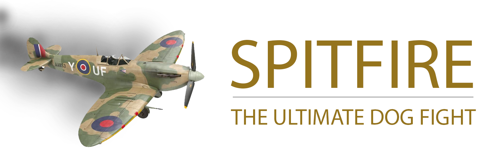

# Spitfire
A simple two player 2nd World War dogfight game. Please note that this game is not completed!

Missing features:
- Shooting
- Smoke trail when damaged
- Plane health counter
- Crash of the sky

## Controls
Player 1
> Left and right arrows

Player 2
> Key A (left) and D (right)

## Project setup
Clone project on the local machine:

```
git clone https://github.com/juhasev/spitfire.git
```

Next install Node dependencies
```
npm install
npm run serve
```

Next click on the link below to start the game in the browser

[http://localhost:8081/](http://localhost:8081/)

