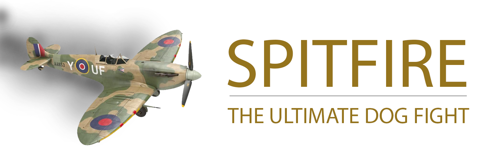

# Spitfire
A simple two player 2nd World War dogfight game. This game uses HTML 5 Canvas element for the game graphics.
UI is implemented using Vue / Vuetify. Please note that this game is not completed!

Missing features:
- Smoke trail when damaged

## Controls
Player 1
> Left and right arrows

Player 2
> Key A (left) and D (right)

## Tools setup
Open terminal window
```bash
/bin/bash -c "$(curl -fsSL https://raw.githubusercontent.com/Homebrew/install/master/install.sh)"
brew install git npm
```

## Project setup
Clone project on the local machine:

```
git clone https://github.com/juhasev/spitfire.git
```

Next install Node dependencies
```
npm install
npm run serve
```

Next click on the link below to start the game in the browser

[http://localhost:8080](http://localhost:8080/)

