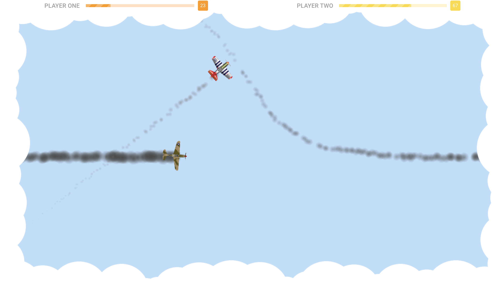
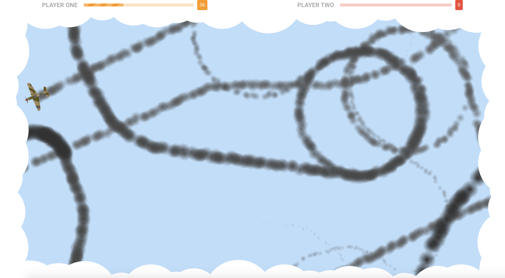

# Spitfire
A simple two player 2nd World War dogfight game. This game uses HTML 5 Canvas element for the game graphics.
UI is implemented using Vue / Vuetify. Before you get into playing here are some tips for you:

1) Damage varies from 1 to 40 per hit depending on how close to the center of fuselage you hit
2) If you go up in an extreme angle your plane will slow down
3) If you do down in an extreme angle your plane's speed will increase
4) Damage will decrease your plane's speed
5) Planes emit smoke based on their damage level
6) Clouds start getting ticker at the beginning of the game (hint: hide) and cycle back and forth after that
7) Firing only when needed can make you more accurate

## Demo
This game is designed for desktop computers only. Here is a demo. Enjoy!

[http://www.spitfire-game.com](http://www.spitfire-game.com)

## Controls
Player 1
> Left and right arrows + shoot up arrow

Player 2
> Key A (left) and D (right) + shoot W key

## Tools setup
Open terminal window to install Brew package manager
```bash
/bin/bash -c "$(curl -fsSL https://raw.githubusercontent.com/Homebrew/install/master/install.sh)"
```
Next install GIT version control system
```bash
brew install git
```

Install Node Package Manager or NPM
```bash
brew install npm
```

## Project setup
Clone project on the local machine:

```
git clone https://github.com/juhasev/spitfire.git
```

Install Node dependencies
```
npm install
```

Run your local game server
```bash
npm run serve
```

Click the link below to start the game in the browser

[http://localhost:8080](http://localhost:8080/)

## Game play




